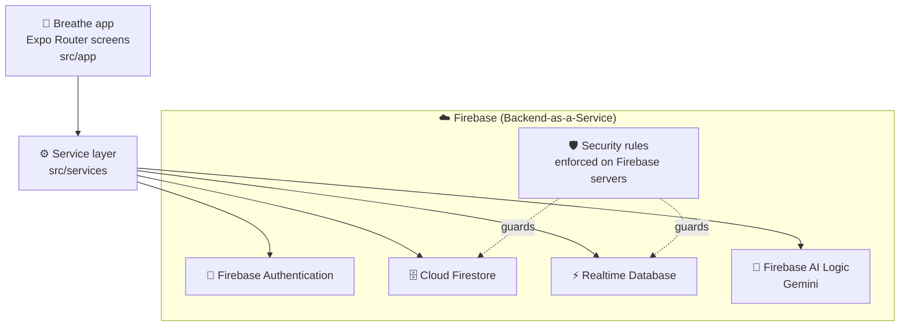
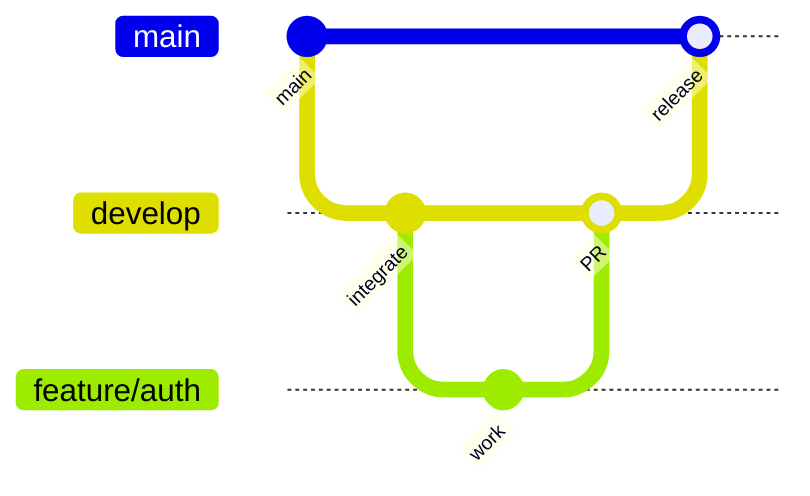

<div align="center">


# Breathe

**A calm space for SLIIT students to check in on their mood and reach a counsellor.**

[](https://docs.expo.dev/)
[](https://reactnative.dev/)
[](https://www.typescriptlang.org/)
[](https://firebase.google.com/)
[](#-getting-started)

SLIIT · IT3060 Human Computer Interaction · Group **WE_124** · Milestone 03

</div>

---

## 👋 About

University students often struggle quietly with stress, exam pressure and low mood, and many never reach out because asking for help feels awkward or public. **Breathe** is a mobile app for SLIIT students that makes a daily mood check-in take under two minutes, offers self-help exercises, and lets students book a campus counsellor (anonymously, if they prefer). Counsellors, lecturers and administrators each get their own privacy-safe view of the app.

> [!IMPORTANT]
> **Breathe is not a replacement for professional help.**
> If you or someone else is in danger, call **1990** (Suwa Seriya ambulance) or **119** (Police emergency) now.
> For mental health support, call the **National Mental Health Helpline: 1926** (free, 24/7).

## 📑 Table of contents

- [About](#-about)
- [Screenshots](#-screenshots)
- [Features](#-features)
- [Privacy & Safety by design](#-privacy--safety-by-design)
- [Team](#-team)
- [Tech stack](#%EF%B8%8F-tech-stack)
- [Architecture](#%EF%B8%8F-architecture)
- [Project structure](#-project-structure)
- [Getting started](#-getting-started)
- [Firebase setup](#-firebase-setup)
- [Download the APK](#-download-the-apk)
- [Test accounts](#-test-accounts)
- [Git workflow](#-git-workflow)
- [Testing](#-testing)
- [Known limitations](#%EF%B8%8F-known-limitations)
- [Future work](#-future-work)
- [Acknowledgements](#-acknowledgements)
- [Licence](#-licence)

## 📸 Screenshots

<table>
  <tr>
    <td align="center" width="33%"><br /><sub><b>Onboarding</b></sub></td>
    <td align="center" width="33%"><br /><sub><b>Login</b></sub></td>
    <td align="center" width="33%"><br /><sub><b>Home</b></sub></td>
  </tr>
  <tr>
    <td align="center"><br /><sub><b>Mood check-in</b></sub></td>
    <td align="center"><br /><sub><b>Mood history</b></sub></td>
    <td align="center"><br /><sub><b>Reminders</b></sub></td>
  </tr>
  <tr>
    <td align="center"><br /><sub><b>Counsellor booking</b></sub></td>
    <td align="center"><br /><sub><b>Counsellor dashboard</b></sub></td>
    <td align="center"><br /><sub><b>Admin panel</b></sub></td>
  </tr>
  <tr>
    <td align="center"><br /><sub><b>Lecturer trends</b></sub></td>
    <td align="center"><br /><sub><b>Crisis support</b></sub></td>
    <td align="center"><br /><sub><b>AI companion</b></sub></td>
  </tr>
</table>

## ✨ Features

### 🎓 Student

- 👋 **Onboarding and sign-in**: register, log in, reset a forgotten password, or *Continue Anonymously* as a guest
- 😊 **Daily mood check-in**: pick a mood (1–5), optionally add factors and a note; designed to finish in under 2 minutes, one entry per day (editable)
- 📈 **Mood history**: week, month or all-time chart, with the same numbers as text, your average and gentle patterns
- ⏰ **Check-in reminders**: up to 5 weekly reminders with your own times and days, delivered as local notifications
- 🧘 **Self-help resources**: published articles and guided exercises with search, filters and "Recommended for you" based on today's check-in
- 🗓️ **Counsellor booking**: browse counsellors, pick a day, time and session type, book anonymously, then view, cancel or review your sessions
- 💬 **Session chat** with your counsellor, plus a video call screen
- 🤖 **AI companion**: a short, supportive peer-style chat powered by Gemini, with crisis-language detection that redirects to help
- 🆘 **Crisis support**: one-tap calls to verified Sri Lankan emergency and mental health lines, with a breathing guide; available even when logged out
- 🔒 **Privacy & data**: anonymous mode, choose whether counsellors see your mood data, read the privacy policy, and **Delete My Data**
- 👤 **Profile**: your name, email, anonymous ID and a summary of your check-ins

### 🩺 Counsellor

- 📊 **Dashboard** with today's sessions and key numbers
- 📥 **Session requests**: accept or decline booking requests, with a reason
- 📅 **Schedule**: day, week and month views, add sessions, manage availability
- 💬 **Messages**: chat inbox with students
- 🔔 **Alerts**: notification centre and clinical alert preferences (triage thresholds, quiet hours)
- 📝 **Session notes**, past sessions and a patient list
- 🖼️ **Profile photo** set by an admin
- ⏳ Staff sign-ups wait on a **pending approval** screen until an admin approves them

### 👩‍🏫 Lecturer

- 🗂️ **Overview**: this week at a glance, from anonymous weekly totals only
- 📉 **Trends**: last 8 weeks of average mood and participation, as charts and a table
- 🛡️ **Privacy threshold**: weeks with fewer than 5 check-ins never show a breakdown
- 📚 **Resources**: read-only list of published resources to recommend to students, plus Crisis Support

### 🛠️ Admin

- 📊 **Dashboard** with user, counsellor and resource counts
- ✅ **Staff approval**: approve or reject counsellor and lecturer sign-up requests
- 👥 **Users**: list users and change roles (student / counsellor / lecturer)
- 🩺 **Counsellors**: create, edit and delete counsellor profiles and photos
- 📚 **Resources**: create, edit, preview, publish and unpublish articles and exercises
- 🧪 **Demo stats**: generate and remove sample weekly stats so every lecturer view can be demonstrated

## 🔐 Privacy & Safety by design

| | What we did | Why |
|---|---|---|
| 🆔 | **Anonymous ID**: every user gets an `anonId`; bookings carry `studentAnonId`, so counsellors never read the `users` collection | Counsellors see what they need, not real names and emails |
| 👻 | **Guest mode**: *Continue Anonymously* uses Firebase anonymous sign-in | Students can try Breathe without giving any details |
| 🗑️ | **Delete My Data**: removes the student's data, then the account itself | The student stays in control of their data |
| 🔕 | **Neutral notification text**: reminders just say *"Breathe – Time for your daily check-in"* | Nothing sensitive shows on a lock screen |
| ✅ | **Staff approval**: nobody can pick a staff role at sign-up; counsellors and lecturers *request* one and an admin approves it | Stops anyone posing as a counsellor |
| ☎️ | **Verified crisis numbers**: all numbers live in [`src/constants/helplines.ts`](src/constants/helplines.ts), checked against official sources on **5 October 2026** (the same date is shown on the Crisis Support screen) | One place to keep life-critical numbers correct |
| 🤖 | **AI companion stores no data**: conversations stay in memory on the device and are never saved; it never asks for names or IDs | No chat log about a student's feelings exists anywhere |
| 📊 | **Anonymous weekly stats**: lecturer data has no uid, anonId or per-person timestamp, and is hidden below 5 responses | Lecturers see trends, never individuals |
| 🧱 | **Server-side security rules**: every collection is checked in [`firestore.rules`](firestore.rules); anything not matched is denied | The app can't be tricked into reading someone else's data |

## 👥 Team

| Member | Role / modules | GitHub |
|---|---|---|
| **Viduth** (Jayasinghe J M V A, IT23845800) | Authentication, onboarding, privacy, crisis support, admin panel, lecturer side, AI companion, staff approval, counsellor photos | [@Viduth04](https://github.com/Viduth04) |
| **Ishara** (TODO: student ID) | Home, mood check-in, mood history, exercises, profile, reminders | TODO |
| **Minhaj** (TODO: student ID) | Student booking and sessions | TODO |
| **Muaath** (TODO: student ID) | Counsellor dashboard, chat, notifications, testing | TODO |

## 🛠️ Tech stack

| Layer | Technology |
|---|---|
| Framework | [Expo SDK 57](https://docs.expo.dev/) · [React Native 0.86](https://reactnative.dev/) · React 19 |
| Language | TypeScript 6 |
| Navigation | Expo Router (file-based, typed routes) |
| Authentication | Firebase Authentication (email/password + anonymous) |
| Database | Cloud Firestore (main data) · Firebase Realtime Database (online status, typing, call signalling) |
| File storage | Firebase Storage (counsellor avatars) |
| AI | Firebase AI Logic (`firebase/ai`) with Gemini (`gemini-3.5-flash-lite`) |
| Notifications | `expo-notifications` (local, on-device scheduling) |
| UI | `react-native-svg`, `expo-linear-gradient`, `expo-image`, `@expo/vector-icons`, Reanimated |
| Local storage | AsyncStorage (auth session, AI consent flag) |
| Tooling | ESLint (`eslint-config-expo`), EAS Build |

## 🏗️ Architecture



Firebase is our **Backend-as-a-Service**, so there is **no separate backend folder**. Screens never talk to Firebase directly; they call small functions in `src/services`, which read and write Firestore, the Realtime Database and Gemini. Who can read or write what is decided by the security rules running on Firebase's servers, not by the app, so a modified app still can't reach other people's data.

## 📁 Project structure

```text
breathe-app/
├── assets/                 App icon, splash and onboarding images
├── design/                 Design references for the auth screens
├── docs/screenshots/       Screenshots used in this README
├── functions/              Placeholder for Cloud Functions (not deployed; Spark plan)
├── src/
│   ├── app/                Expo Router screens, one folder per role
│   │   ├── (auth)/         Welcome, login, register, forgot password
│   │   ├── (student)/      Home, check-in, mood history, booking, companion, ...
│   │   ├── (counsellor)/   Counsellor tabs: dashboard, schedule, messages, alerts
│   │   ├── (counsellor-detail)/  Counsellor detail screens (requests, notes, calls)
│   │   ├── (lecturer)/     Overview, trends, resources
│   │   ├── (admin)/        Dashboard, users, counsellors, resources
│   │   ├── crisis.tsx      Crisis Support (open to everyone)
│   │   └── pending-approval.tsx  Waiting screen for staff sign-ups
│   ├── components/         Reusable UI, grouped by feature
│   ├── constants/          Verified helpline numbers
│   ├── context/            Auth and counsellor badge context
│   ├── firebase/           Firebase initialisation from .env
│   ├── hooks/              Shared hooks (reminders, week stats, alerts)
│   ├── services/           All Firebase reads/writes and the AI companion
│   ├── theme/              Colours, spacing, typography
│   ├── types/              Shared TypeScript types (match the security rules)
│   └── utils/              Crisis-language check, validation, week helpers
├── firestore.rules         Cloud Firestore security rules
├── storage.rules           Firebase Storage security rules
└── .env.example            Names of the environment variables you need
```

## 🚀 Getting started

### Prerequisites

- [Node.js](https://nodejs.org/) LTS and npm
- [Git](https://git-scm.com/)
- The **Expo Go** app on your phone, or an Android emulator / iOS simulator
- Access to the team's Firebase project (or your own; see [Firebase setup](#-firebase-setup))

### 1. Clone and install

```bash
git clone https://github.com/Viduth04/breathe-app.git
cd breathe-app
npm install
```

### 2. Set up environment variables

Copy the example file and fill in the values from the Firebase console (*Project settings → Your apps*):

```bash
cp .env.example .env
```

| Variable | |
|---|---|
| `EXPO_PUBLIC_FIREBASE_API_KEY` | |
| `EXPO_PUBLIC_FIREBASE_AUTH_DOMAIN` | |
| `EXPO_PUBLIC_FIREBASE_PROJECT_ID` | |
| `EXPO_PUBLIC_FIREBASE_STORAGE_BUCKET` | |
| `EXPO_PUBLIC_FIREBASE_MESSAGING_SENDER_ID` | |
| `EXPO_PUBLIC_FIREBASE_APP_ID` | |
| `EXPO_PUBLIC_FIREBASE_DATABASE_URL` | Optional: online status, typing and call signalling are switched off without it |

> [!WARNING]
> Never commit `.env`. It is already listed in `.gitignore`. Share the values privately within the team.

### 3. Run the app

```bash
npx expo start --clear
```

Scan the QR code with **Expo Go** (Android) or the Camera app (iOS). Other scripts: `npm run android`, `npm run ios`, `npm run web`, `npm run lint`.

> [!NOTE]
> **Reminder notifications need the installed APK on Android.** Expo Go on Android no longer supports these notifications, so reminders are saved there but never fire. Install the [APK](#-download-the-apk) to test them.

## 🔥 Firebase setup

<details>
<summary><b>Show the Firebase setup steps</b></summary>

1. **Enable services** in the Firebase console: Authentication (*Email/Password* and *Anonymous* providers), Cloud Firestore, Realtime Database, and Firebase AI Logic (Gemini Developer API).
2. **Publish the Firestore rules**: *Firestore Database → Rules*, replace **everything** with the contents of [`firestore.rules`](firestore.rules), then **Publish**. Delete any old test-mode `match /{document=**}` rule first; rules are OR'd, so while it exists every other rule is ignored.
3. **Publish the Realtime Database rules**: *Realtime Database → Rules*, paste `database.rules.json`, then **Publish**.
   > **TODO:** `database.rules.json` is not in the repo yet. The final rules for `status`, `typing` and `calls` will be added on 8 October 2026.
4. **(Optional) Storage rules**: *Storage → Rules*, paste [`storage.rules`](storage.rules) (counsellor avatars).
5. **Create the first admin**: sign up in the app, then in *Firestore → users → {your uid}* change the field `role` to `"admin"`. Admin can only be set from the console; the app never lets anyone choose or grant it.
6. **Approve staff**: counsellors and lecturers register in the app, then an admin approves them from the admin panel.

</details>

## 📦 Download the APK

**[⬇️ Download Breathe for Android](#)** · TODO: add the EAS build link

The APK was built with EAS Build:

```bash
npm install -g eas-cli
eas login
eas build -p android --profile preview
```

> **TODO:** `eas.json` is not in the repo yet. Commit it, and confirm the profile name used (`preview` produces an installable `.apk`).

## 🧪 Test accounts

| Role | Email |
|---|---|
| Admin | `admin@breathe.test` |
| Counsellor | `counsellor@breathe.test` |
| Lecturer | `lecturer@breathe.test` |
| Student | Register in the app, or tap *Continue Anonymously* |

🔑 Passwords are shared privately with the module team.

## 🌿 Git workflow



- **`main`**: stable, submitted versions only
- **`develop`**: integration branch; every feature is merged here first
- **`feature/<name>`**: one branch per feature (e.g. `feature/auth`, `feature/checkin`, `feature/counsellor-features`)
- All changes go through a **pull request into `develop`**, and `develop` is merged into `main` for each milestone

## ✅ Testing

<details>
<summary><b>Functional testing</b></summary>

- Functional test cases for every functional requirement (FR01–FR09) and non-functional requirement (NFR01–NFR03)
- A traceability matrix linking requirements → test cases → results
- 📄 TODO: link to the test case document
- 📄 TODO: link to the traceability matrix

</details>

<details>
<summary><b>Usability testing</b></summary>

- Usability testing with **5 participants** on the main student tasks (check-in, booking, finding crisis support)
- 📄 TODO: link to the usability test plan, tasks and results
- 📄 TODO: summarise key findings and the changes made because of them

</details>

### Video consultations

Student and counsellor video calls use Jitsi Meet embedded in the app. Calls use a stable room name derived from the booking ID, so both participants join the same room without Cloud Functions, an API key, or Firebase Blaze billing.

Jitsi Meet is a public meeting service: access is based on having the room name, not on Breathe account authorization. Anyone who obtains that name may be able to join. Keep booking documents protected by Firestore rules and avoid sharing room links outside the participants.

## ⚠️ Known limitations

We'd rather be honest about what Breathe doesn't do yet:

- 🛡️ **Firebase App Check is not enforced**, so the API could be called from outside the app (security rules still apply).
- 💬 **Chat is not true end-to-end encrypted.** Messages are protected by the security rules and encrypted in transit and at rest by Firebase, but not encrypted on the device.
- 📊 **Lecturer aggregates are computed on the client.** Students add to anonymous weekly totals from the app instead of a trusted server function.
- 🧪 **Demo stats**: lecturer charts can show admin-generated sample data (marked `demo: true`) so every state can be shown.
- 💸 **Spark (free) plan**: no Cloud Functions, so there are no server-side triggers or push notifications; reminders are local only.
- 🟢 **Online status is visible to any signed-in user** through the Realtime Database presence data.
- 🎥 **Jitsi room access is link-based**: Breathe does not authenticate meeting participants with Jitsi; anyone with a room name may be able to join.
- 🧩 **Some counsellor screens still use sample data** (`src/services/mock*.ts`).

## 🔭 Future work

- Enforce App Check and move stats aggregation into Cloud Functions (Blaze plan)
- True end-to-end encrypted chat
- Server push notifications for booking updates
- Sinhala and Tamil translations
- Replace the remaining sample data on the counsellor side with live Firestore data

## 🙏 Acknowledgements

- **Sri Lanka Institute of Information Technology (SLIIT)**
- **IT3060 Human Computer Interaction** lecturers and lab instructors
- Everyone who took part in our usability testing
- Helpline information from official sources, including [Sri Lanka Sumithrayo](https://srilankasumithrayo.lk/)

## 📄 Licence

Academic project for SLIIT IT3060, **not for commercial use**.

<div align="center">
<sub>Made with 💚 by Group WE_124</sub>
</div>
